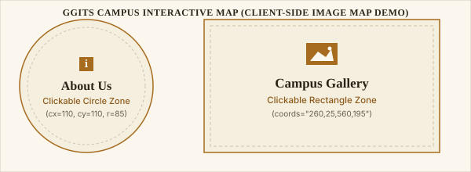

# RGPV University 5th Sem - Internet & Web Technology (IWT) Practical Assignment

**Institution:** Gyan Ganga Institute of Technology and Sciences (GGITS), Jabalpur  
**Subject:** Internet & Web Technology (IWT)  
**Semester:** 5th Semester  

---

## 📁 Assignment File Structure

The project has been created in your working directory with the following files:

| File Name | Purpose & Contents |
| :--- | :--- |
| [`index.html`](file:///c:/Users/91932/Documents/PROGRAMMING/IWT_Assignment/index.html) | Master frameset container dividing the window into 3 horizontal frames (`rows="18%,10%,72%"`). Contains beginner HTML comments for professor viva defense. |
| [`banner.html`](file:///c:/Users/91932/Documents/PROGRAMMING/IWT_Assignment/banner.html) | Top header frame containing the circular institute logo badge (`GG`), GGITS title, and RGPV 5th Sem subtitle. Styled with off-white/blue gradient and navy border. |
| [`nav.html`](file:///c:/Users/91932/Documents/PROGRAMMING/IWT_Assignment/nav.html) | Horizontal navigation bar styled in navy blue (`#002147`) with 3 links targeting `mainFrame`. |
| [`main.html`](file:///c:/Users/91932/Documents/PROGRAMMING/IWT_Assignment/main.html) | Main content frame featuring the Client-Side Image Map (`<map>`, `<area>`) and the Visitor Hit Counter (`sessionStorage` & `localStorage`). |
| [`map-image.svg`](file:///c:/Users/91932/Documents/PROGRAMMING/IWT_Assignment/map-image.svg) | Standalone vector graphic (600x220) with labeled circle & rectangle regions whose coordinates match `<area>` tags in `main.html` exactly. |
| [`about.html`](file:///c:/Users/91932/Documents/PROGRAMMING/IWT_Assignment/about.html) | Target page opened when clicking the **Circle Zone** (`cx=110, cy=110, r=85`). Includes a "Back to Home" button. |
| [`gallery.html`](file:///c:/Users/91932/Documents/PROGRAMMING/IWT_Assignment/gallery.html) | Target page opened when clicking the **Rectangle Zone** (`coords="260,25,560,195"`). Includes a "Back to Home" button. |

---

## 🎯 Key Technical Concepts Implemented

### 1. HTML Frameset Layout (`<frameset>`, `<frame>`, `<noframes>`)
```html
<frameset rows="18%,10%,72%" frameborder="1" border="2" bordercolor="#002147">
    <frame src="banner.html" name="bannerFrame" scrolling="no" noresize="noresize">
    <frame src="nav.html" name="navFrame" scrolling="no">
    <frame src="main.html" name="mainFrame" scrolling="auto">
    <noframes>
        <body><p>Your browser does not support HTML framesets.</p></body>
    </noframes>
</frameset>
```
* **Explanation:** Divides the window into 3 horizontal sections. Links in [`nav.html`](file:///c:/Users/91932/Documents/PROGRAMMING/IWT_Assignment/nav.html) use `target="mainFrame"` to load new content strictly inside the 3rd frame without refreshing the header or navigation bar.

---

### 2. Client-Side Image Mapping (``, `<map>`, `<area>`)
```html


<map name="campusMap">
    <!-- Circle Area: Center (110, 110), Radius 85 -->
    <area shape="circle" coords="110,110,85" href="about.html" target="mainFrame" alt="About Us">
    
    <!-- Rect Area: Top-Left (260, 25) to Bottom-Right (560, 195) -->
    <area shape="rect" coords="260,25,560,195" href="gallery.html" target="mainFrame" alt="Gallery">
</map>
```
* **Explanation:** Links spatial regions of an image to different HTML pages. Coordinates in [`main.html`](file:///c:/Users/91932/Documents/PROGRAMMING/IWT_Assignment/main.html) correspond strictly to the vector elements drawn inside [`map-image.svg`](file:///c:/Users/91932/Documents/PROGRAMMING/IWT_Assignment/map-image.svg).

---

### 3. Session & Local Storage Hit Counter (`sessionStorage` & `localStorage`)
```javascript
// 1. Session Variable (Resets when browser tab is closed)
let sessionVisits = sessionStorage.getItem('sessionVisits') || 0;
sessionVisits = parseInt(sessionVisits, 10) + 1;
sessionStorage.setItem('sessionVisits', sessionVisits);
document.getElementById('sessionCountDisplay').textContent = sessionVisits;

// 2. Permanent Counter (Persists across browser restarts)
let totalVisits = localStorage.getItem('totalVisits') || 0;
totalVisits = parseInt(totalVisits, 10) + 1;
localStorage.setItem('totalVisits', totalVisits);
document.getElementById('localCountDisplay').textContent = totalVisits;
```
* **Explanation:** Demonstrates browser-side state management without requiring backend databases. `sessionStorage` tracks page loads within the active browser session, while `localStorage` stores persistent visitor statistics.

---

## 🏷️ HTML Tag Variety Checklist (21 Tags Used)
The assignment utilizes 21 distinct HTML tags across the project (surpassing the minimum required 10):
`<!DOCTYPE>`, `<html>`, `<head>`, `<meta>`, `<title>`, `<style>`, `<frameset>`, `<frame>`, `<noframes>`, `<body>`, `<header>`, `<nav>`, `<div>`, `<h1>`, `<h2>`, `<h3>`, `<p>`, `<span>`, `<b>`, `<a>`, ``, `<map>`, `<area>`, `<script>`.

---

## 🚀 How to Run & Present

1. Open File Explorer and navigate to `c:/Users/91932/Documents/PROGRAMMING/IWT_Assignment`.
2. Double-click [`index.html`](file:///c:/Users/91932/Documents/PROGRAMMING/IWT_Assignment/index.html) to launch in any web browser.
3. No server setup, Node.js, or external dependencies are required.
